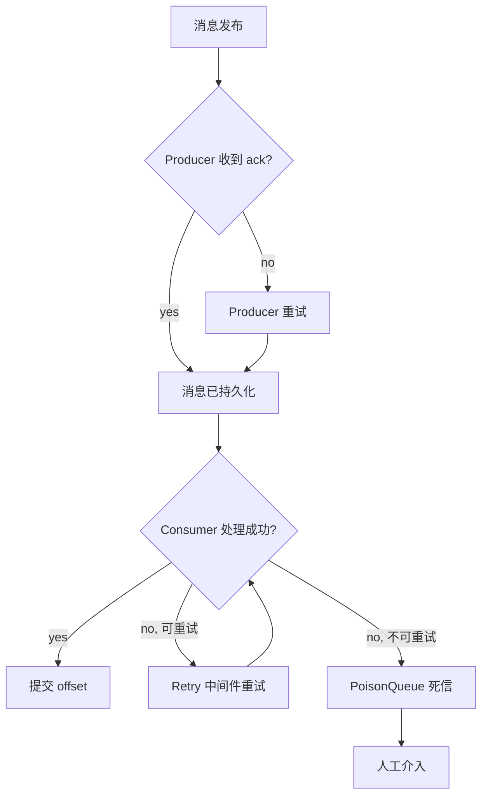

# 16 - 可靠性保障

事件驱动系统的可靠性保障涉及消息传递语义、故障恢复和死信处理。本章分析 Watermill + Kafka 的可靠性机制。

## 投递语义

分布式消息系统有三种投递保证级别：

| 语义 | 说明 | Watermill + Kafka |
|------|------|-------------------|
| At-most-once | 消息最多投递一次，可能丢失 | 关闭重试、自动 ACK |
| At-least-once | 消息至少投递一次，可能重复 | **默认行为** |
| Exactly-once | 消息恰好投递一次 | 需要额外机制 |

Watermill + Kafka 默认实现 **at-least-once**：
1. Producer 等待 broker ack（`acks=all`）确认写入
2. Consumer 处理成功后才提交 offset（`msg.Ack()`）
3. 处理失败触发 NACK，消息被重新投递

## 多层重试机制

Watermill 提供三层重试保障：

### 1. Router 级别重试（Retry 中间件）

```go
// ecommerce/cmd/order-service/main.go:71
router.AddMiddleware(middleware.Retry{
    MaxRetries:      3,
    InitialInterval: time.Second,
    Logger:          watermillLogger,
}.Middleware)
```

适用于业务逻辑瞬时错误（数据库死锁、乐观锁冲突、临时网络故障），指数退避避免重试风暴。

### 2. Kafka 级别重试

Consumer 未提交 offset 时，消息在 Kafka 中保留（默认 7 天）。Consumer 重启后从上次提交的 offset 继续消费。

### 3. PoisonQueue 死信处理

重试耗尽后，消息进入毒药队列：

```go
poisonQueue, _ := gochannel.NewGoChannel(gochannel.Config{}, logger)
router.AddMiddleware(middleware.PoisonQueue(poisonQueue, "dead_letter"))
```

运维人员可定期检查毒药队列，手动处理或重放消息。

## 消息持久化

Kafka 数据持久化到磁盘，默认保留策略：

```
log.retention.hours=168  # 7 天
log.segment.bytes=1073741824  # 1GB 段文件
```

这意味着即使所有消费者宕机 7 天，消息也不会丢失。恢复后从上次 offset 继续消费。

## Exactly-once 语义探讨

Exactly-once 在分布式系统中极其困难，因为"写数据库 + 发消息 + 提交 offset"三者无法原子化。

**Kafka 事务**（idempotent producer + transactional consumer）可以在 Kafka 内部实现 exactly-once，但不包含数据库操作。Watermill 目前未直接支持 Kafka 事务。

**实用的"等价 exactly-once"**：通过 at-least-once + 幂等消费，最终效果与 exactly-once 一致。代价是消费者需要实现幂等逻辑，但这是相对简单且可靠的方法。

## 故障场景与恢复



### Consumer Crash

处理中但未 ACK 的消息：offset 未提交，重启后重新消费（需幂等）
已处理且 ACK 的消息：offset 已提交，不会重复消费

### Kafka Broker 宕机

- 单 broker 宕机：ISR 中的 follower 自动选举为新 leader
- Broker 恢复后从 leader 同步数据
- Producer 和 Consumer 自动切换 leader

## 监控指标

关键可靠性指标：

- **消费 lag**：Consumer 落后 Producer 的消息数量，升高表示处理瓶颈
- **重试率**：Retry 触发的消息比例，突增表示下游异常
- **死信数**：进入 PoisonQueue 的消息数，需人工关注
- **ACK/NACK 比例**：消费成功率风向标

使用 Watermill 的 Prometheus 集成（参见第 17 章）采集这些指标。
