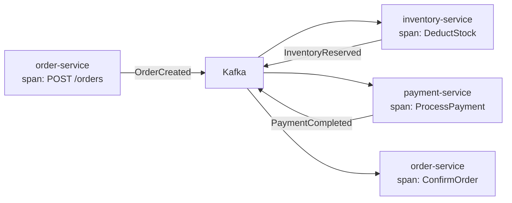

# 17 - 可观测性与监控

生产环境的事件驱动系统必须具备完善的可观测性。Watermill 支持 Prometheus 指标、OpenTelemetry 追踪和结构化日志三大支柱。

## Prometheus 指标

Watermill 内置 Prometheus 指标构建器 `message/infrastructure/metrics`，自动注册到全局 registry。

基础用法（`basic/05-metrics/main.go`）展示了自定义指标的集成：

```go
var messagesProcessed = prometheus.NewCounter(prometheus.CounterOpts{
    Name: "demo_messages_processed_total",
    Help: "Total number of messages processed",
})

func init() {
    prometheus.MustRegister(messagesProcessed)
}

// Handler 中记录指标
func(msg *message.Message) error {
    messagesProcessed.Inc()
    // ...
}
```

启动指标 HTTP 端点（`basic/05-metrics/main.go:54-58`）：

```go
http.Handle("/metrics", promhttp.Handler())
http.ListenAndServe(":2112", nil)
```

### Watermill 内置指标

使用 Watermill 的 Prometheus 中间件可自动采集以下指标：

| 指标名 | 类型 | 说明 |
|--------|------|------|
| `subscriber_messages_received_total` | Counter | 收到的消息总数 |
| `handler_execution_time_seconds` | Histogram | Handler 执行耗时分布 |
| `handler_errors_total` | Counter | Handler 错误总数 |
| `handler_success_total` | Counter | Handler 成功总数 |
| `publisher_publish_time_seconds` | Histogram | 发布耗时分布 |

### 指标集成方式

在 Router 中添加指标中间件：

```go
metricsBuilder := metrics.NewPrometheusMetricsBuilder(
    prometheus.DefaultRegisterer,
    "watermill",     // namespace
    "ecommerce",     // subsystem
)
metricsBuilder.AddPrometheusRouterMetrics(router)
```

## OpenTelemetry 分布式追踪

在 Saga 流程中，一个订单经过 4 个服务、多个事件——分布式追踪是理解端到端延迟和定位瓶颈的关键。



实现方式：将 trace context 注入 `msg.Metadata`，在服务间传播：

```go
// 生产者：注入 trace context
carrier := propagation.MapCarrier{}
otel.GetTextMapPropagator().Inject(ctx, carrier)
for k, v := range carrier {
    msg.Metadata.Set(k, v)
}

// 消费者：提取 trace context
ctx := otel.GetTextMapPropagator().Extract(
    context.Background(),
    propagation.MapCarrier(msg.Metadata),
)
```

Watermill 的 `components/observability` 组件提供了开箱即用的 OpenTelemetry 集成。

## 结构化日志

电商项目使用 Zap 结构化日志，在每层的构造函数中注入 `*zap.Logger`：

```go
// ecommerce/internal/order/biz/usecase.go:40-42
func NewOrderUseCase(repo OrderRepo, log *zap.Logger) *OrderUseCase {
    return &OrderUseCase{repo: repo, log: log}
}

// 结构化日志
uc.log.Info("订单创建成功",
    zap.String("order_id", req.OrderID),
    zap.Float64("total", req.Total),
)
```

### 日志规范

| 场景 | 级别 | 示例 |
|------|------|------|
| 服务启动 | Info | `"服务启动", zap.String("addr", ":8081")` |
| 事件消费 | Info | `"收到支付完成事件", zap.String("order_id", id)` |
| 业务异常 | Warn | `"库存不足", zap.String("product_id", pid)` |
| 系统错误 | Error | `"数据库连接失败", zap.Error(err)` |

### 关联追踪与日志

将 trace ID 注入日志是实现关联分析的关键：

```go
logger := log.With(
    zap.String("trace_id", trace.SpanContextFromContext(ctx).TraceID().String()),
    zap.String("order_id", event.OrderId),
)
logger.Info("支付处理中")
```

这样在 Grafana 中可以通过 trace_id 关联追踪和日志。

## 监控面板建议

在 Grafana 中构建以下面板：

1. **消息吞吐量**：`rate(handler_success_total[1m])` — 各 Handler 的 QPS
2. **错误率**：`rate(handler_errors_total[5m]) / rate(handler_success_total[5m])`
3. **消费延迟**：Kafka consumer lag 指标
4. **P99 延迟**：`histogram_quantile(0.99, handler_execution_time_seconds)`
5. **重试率**：`rate(handler_retries_total[5m])`

结合告警规则（错误率 > 1%、lag > 1000），实现事件驱动系统的全天候可观测。
