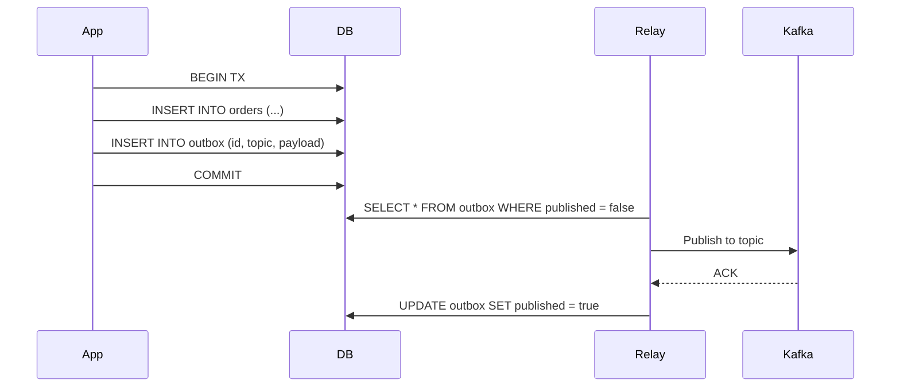

# 18 - Outbox 模式与事务消息

事件驱动系统的经典难题：如何保证**数据库写入和消息发布**两个操作的原子性？Outbox 模式提供了优雅的解决方案。

## 问题分析

在 `ecommerce/internal/order/service/handler.go:47-71` 中，订单创建的流程是：

```go
// 步骤1：写数据库
s.uc.Create(r.Context(), order)

// 步骤2：发消息
s.pub.Publish(events.TopicOrderCreated, msg)
```

如果步骤 2 失败（Kafka 不可用），订单已写入数据库但下游服务未收到通知，数据不一致。反过来先发消息再写库，写库失败也无法回滚已发布的消息。

根本原因：数据库事务和消息队列是两个独立的资源管理器，无法用同一事务包裹。

## Outbox 模式原理

Outbox 模式的核心思想：**将消息发布转化为数据库写入**。



订单表和 outbox 表在同一个数据库事务中写入，保证原子性。Relay 组件（也叫 Forwarder）异步扫描 outbox 表，将未发布的消息发送到 Kafka，成功后标记为已发布。

## Outbox 表设计

```sql
CREATE TABLE outbox (
    id           BIGINT AUTO_INCREMENT PRIMARY KEY,
    topic        VARCHAR(255) NOT NULL,
    payload      BLOB NOT NULL,
    created_at   TIMESTAMP DEFAULT CURRENT_TIMESTAMP,
    published    BOOLEAN DEFAULT FALSE,
    published_at TIMESTAMP NULL,
    INDEX idx_published (published, created_at)
);
```

`published` 字段 + 索引使 Relay 可以高效扫描待发送消息。

## Watermill Forwarder

Watermill 提供了 `Forwarder` 组件简化 Outbox 模式的实现：

```go
// SQL Subscriber 从 outbox 表读取
sqlSub := sql.NewSubscriber(db, sql.SubscriberConfig{
    ConsumerGroup:    "outbox-relay",
    PollInterval:     time.Second,
    SchemaAdapter:    mysql.DefaultMySQLSchema{},
    InitializeSchema: true,
})

// Kafka Publisher 将消息转发到 Kafka
forwarder := message.NewForwarder(
    sqlSub,
    kafkaPub,
    logger,
)
```

`sql.NewSubscriber` 使用 `mysql.DefaultMySQLSchema` 自动创建和管理 outbox 表，通过轮询方式扫描 `published=false` 的记录。

## CDC 替代方案

对于高吞吐场景，轮询 outbox 表可能成为瓶颈。这时可以用 **CDC（Change Data Capture）**替代：

```
MySQL binlog → Debezium → Kafka → 下游服务
```

CDC 直接监听数据库 binlog 变化，无需应用程序额外写入 outbox 表，延迟极低。但需要引入 Debezium 等组件，运维复杂度增加。

| 方案 | 延迟 | 复杂度 | 适用场景 |
|------|------|--------|---------|
| Outbox + 轮询 | 秒级 | 低 | 中小规模，<1000 msg/s |
| Outbox + CDC | 毫秒级 | 高 | 大规模，需要极致性能 |
| 双写（现状） | 实时 | 最低 | 开发/测试环境 |

## 何时使用 Outbox

不一定所有场景都需要 Outbox 模式。决策树：

```
数据库写 + 消息发 必须原子？
├── 是 → 使用 Outbox 模式
└── 否 → 能否接受最终一致性？
    ├── 能 → 双写 + 补偿（定时校对）
    └── 不能 → 应重新评估架构
```

**适合 Outbox**：订单创建、账户扣款、库存扣减——写库和发消息必须同时成功
**不适合 Outbox**：日志采集、通知发送、数据同步——可以 accept 少量丢失

## 电商项目中的权衡

当前电商项目采用双写模式（先写库后发消息），适用于学习和演示。生产环境建议增强：
1. 引入 Outbox 表保证事务原子性
2. 增加定时补偿任务：扫描超时未收到下游确认的订单，手动重发或标记异常
3. 监控 outbox 表的积压情况，设置告警

Outbox 模式的代价是引入了额外组件（Forwarder）和秒级延迟，换取的是绝对的事务一致性——这是分布式系统中常见的"正确性 vs 性能"权衡。
