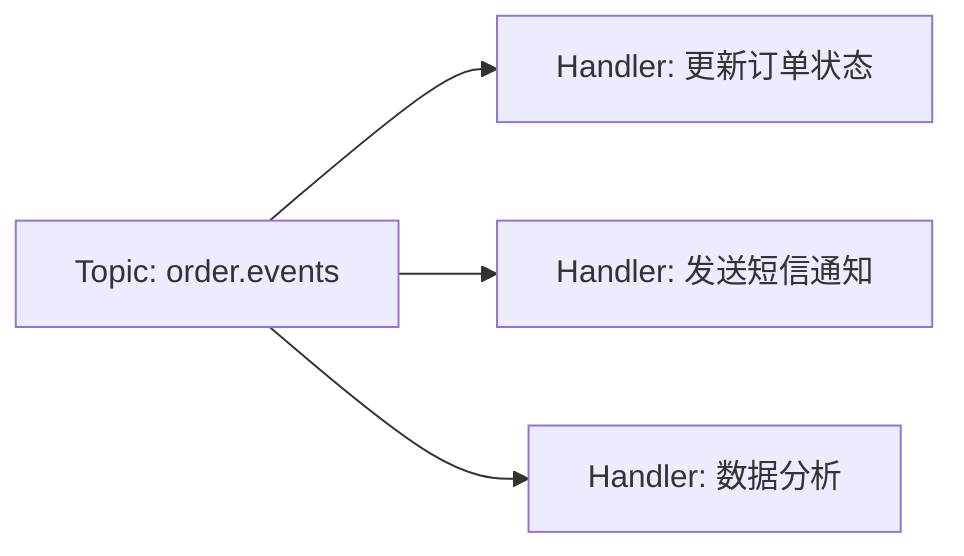
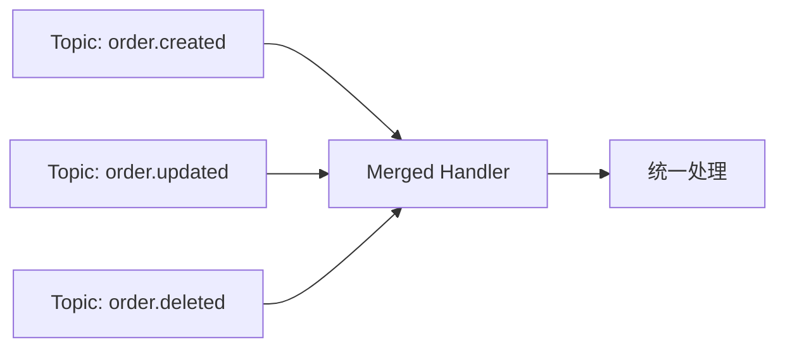

# 19 - FanIn 与 FanOut

FanIn（多对一）和 FanOut（一对多）是消息路由的两种基本拓扑结构。Watermill 的 Router 原生支持这两种模式。

## FanOut：广播到多个 Handler



FanOut 的实现极其简单——在 Router 中为同一 topic 注册多个 Handler：

```go
// ecommerce/cmd/notification-service/main.go:50-52
router.AddNoPublisherHandler("order_created_notify",
    topics.TopicOrderCreated, sub, handler.HandleOrderCreated)
router.AddNoPublisherHandler("payment_completed_notify",
    topics.TopicPaymentCompleted, sub, handler.HandleOrderConfirmed)
router.AddNoPublisherHandler("order_cancelled_notify",
    topics.TopicOrderCancelled, sub, handler.HandleOrderCancelled)
```

在电商项目中，`PaymentCompleted` 事件同时被 order-service（更新订单状态）和 notification-service（发送通知）消费——这就是典型的 FanOut。

### 跨消费者组的 FanOut

Kafka 中，不同消费者组各自独立消费全量消息。因此只要每个服务使用不同的 `consumer_group`，就天然实现了 FanOut：

```go
// order-service: consumer_group = "order-service"
sub1, _ := kafka.NewSubscriber(brokers, "order-service", logger)

// notification-service: consumer_group = "notification-service"
sub2, _ := kafka.NewSubscriber(brokers, "notification-service", logger)
```

两个服务各自收到 `PaymentCompleted` 的完整副本。

### 同消费者组的 FanOut（并发处理）

同一个服务内，设置 `HandlerMaxConcurrency > 1` 可以实现单 partition 内的并发处理（注意这破坏顺序性）：

```go
router, _ := message.NewRouter(message.RouterConfig{
    HandlerMaxConcurrency: 10,
}, logger)
```

10 个 goroutine 并发处理同一 topic 的消息，适合消息之间无依赖、处理耗时的场景。

## FanIn：合并多个 Topic



FanIn 将所有订单相关事件汇入一个 Handler 统一处理：

```go
router.AddHandler(
    "order-created-handler",
    "order.created", pubSub,
    "order.processed", pubSub,
    handler.ProcessOrder,
)
router.AddHandler(
    "order-updated-handler",
    "order.updated", pubSub,
    "order.processed", pubSub,
    handler.ProcessOrder,
)
```

也可以在 Handler 内部调用共享函数实现 FanIn：

```go
func ProcessEvent(msg *message.Message) error {
    switch getEventType(msg) {
    case "OrderCreated":
        return handleOrderCreated(msg)
    case "OrderUpdated":
        return handleOrderUpdated(msg)
    }
    return nil
}
```

## 电商项目中的 FanOut 实践

通知服务是 FanOut 的最佳案例。三种不同事件被路由到各自的通知方法：

```go
// notification/biz/event_handler.go
func (h *NotificationHandler) HandleOrderCreated(msg *message.Message) error {}
func (h *NotificationHandler) HandleOrderConfirmed(msg *message.Message) error {}
func (h *NotificationHandler) HandleOrderCancelled(msg *message.Message) error {}
```

扩展新通知类型只需：
1. 在 `events.go` 中定义新 topic 常量
2. 在 notification-service 中注册新的 `AddNoPublisherHandler`
3. 实现对应的 Handler 方法

无需修改其他服务代码——体现了事件驱动架构的高扩展性。

## 性能考虑

| 模式 | 注意事项 |
|------|---------|
| FanOut（多 Handler） | 每个 Handler 独立运行 goroutine，Router 自动管理。注意 Handler 总数不能超过 partition 数 |
| FanOut（多消费者组） | 每个消费者组独立维护 offset，互不影响。推荐作为默认的广播模式 |
| FanIn | 多个 Handler 写入同一输出 topic 时注意输出 topic 分区策略，避免热点分区 |
| 大 FanOut | 超过 10 个 Handler 时考虑抽离单独的服务而非在一个进程中注册大量 Handler |

GoChannel 模式下，FanOut 通过**为每个订阅者复制消息**实现；Kafka 模式下，FanOut 通过**消费者组独立消费**实现。两者语义一致但实现方式不同——这正是 Watermill 统一抽象的优势。
