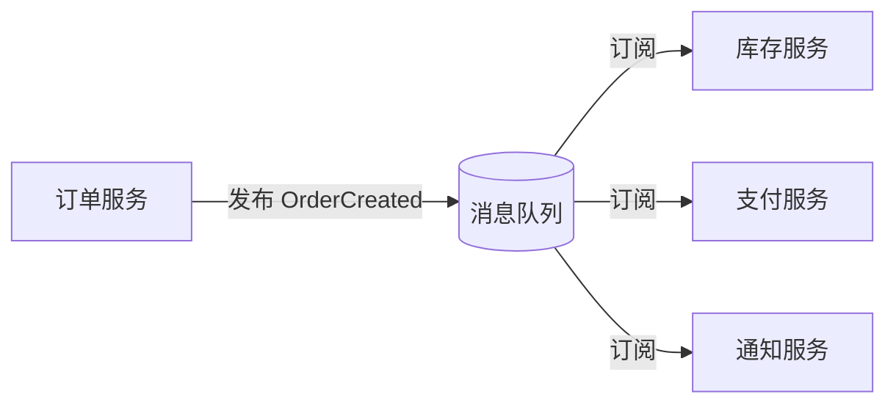

# 01 - 为什么学习 Watermill

## 一、同步通信的局限

在微服务架构早期，服务间通信多采用同步 HTTP/gRPC 调用。这种模式简单直观，但随着系统规模增长，问题逐渐显现：

**紧耦合**。调用方必须知道被调用方的地址、端口，被调用方不可用时请求直接失败。服务A调用服务B，B再调用C，形成调用链——任意一环出问题，整个链路崩溃。

**扩展困难**。当需要在订单创建后同时通知库存、支付、通知三个服务时，订单服务必须逐一调用，代码随下游服务数量线性增长。每新增一个消费者，就要修改订单服务代码。

**一致性挑战**。同步调用中，订单写库成功后调用库存失败，已写入的订单数据需要回滚，分布式事务实现复杂且性能差。

## 二、异步事件驱动的优势

事件驱动架构将"请求-响应"模式改为"发布-订阅"模式：



**解耦**。发布者无需知道消费者是谁，消费者可以动态增减。新增一个数据分析服务只需订阅相应 topic，不影响现有服务。

**弹性**。消费者临时宕机不影响发布者。消息在队列中持久化，消费者恢复后继续处理。配合重试机制，可以优雅处理瞬时故障。

**可扩展**。同一服务的多个实例可以加入同一个消费者组（Consumer Group），消息自动分片，实现水平扩展而无需额外负载均衡组件。

## 三、Watermill 的定位

[Watermill](https://github.com/ThreeDotsLabs/watermill) 是 Go 语言的事件驱动框架，核心理念是 **"Event-driven applications the easy way in Go"**。它提供了一套统一的 Pub/Sub 抽象，让开发者用相同的 API 编写业务逻辑，底层消息传输实现可自由切换。

```go
// 发布消息 —— 所有 Pub/Sub 后端统一接口
pub.Publish("order.created", msg)

// 订阅消息 —— 返回 channel，配合 Router 自动消费
messages, _ := sub.Subscribe(ctx, "order.created")
```

## 四、与其他方案对比

| 方案 | 优点 | 缺点 |
|------|------|------|
| 裸 Kafka SDK (sarama) | 性能极致，配置灵活 | 代码量大，缺少重试/路由等通用能力 |
| NATS Go Client | 简单轻量 | 绑死 NATS，无法切换 |
| Watermill | 统一抽象，多后端可互换，内置路由/中间件/CQRS | 有一层抽象开销（通常可忽略） |

Watermill 的价值在于：编写业务逻辑时面对的是 `message.Publisher` 和 `message.Subscriber` 接口，而非具体的 Kafka/NATS/RabbitMQ SDK。单元测试用进程内 `GoChannel`（零依赖、零配置），生产环境只需切换底层实现——**一行代码改 Kafka 为 NATS**。

## 五、本项目学习路径

本项目的 `basic/` 目录包含 5 个独立可运行的示例（GoChannel 零依赖）。`ecommerce/` 目录是一个基于 Kafka 的完整电商事件驱动系统，演示 Saga 分布式事务、顺序消费、可靠投递等实战模式。

**建议阅读顺序**：基础篇（本文档 01-06）→ 实战篇（07-13）→ 进阶篇（14-20）→ 扩展篇（21-23）。
