# 04 - Router 路由机制

Router 是 Watermill 的"大脑"。它连接消息的生产与消费，管理 Handler 注册、中间件链路、并发控制和消息分发。

## Router 架构

```mermaid
flowchart TD
    SUB[Subscriber] -->|""chan *Message""| R[Router]
    R --> MW0[Recoverer]
    MW0 --> MW1[Retry]
    MW1 --> MW2[Timeout]
    MW2 --> D{解析 Handler 列表}
    D --> H1[Handler: order-handler]
    D --> H2[Handler: even-handler]
    H1 -->|返回消息| OUT[输出 Topic]
    OUT --> PUB[Publisher]
```



Router 通过 `message.NewRouter()` 创建，配置项包括 Handler 并发数（`HandlerMaxConcurrency`）和全局超时等。

核心调用流程（参见 `basic/02-router/main.go:22-51`）：

```go
router, _ := message.NewRouter(message.RouterConfig{}, logger)
router.AddMiddleware(middleware.Recoverer)

router.AddHandler(
    "order-handler",   // Handler 名称（用于日志/指标）
    "order.created",   // 输入 Topic
    pubSub,            // 输入 Subscriber
    "order.even",      // 输出 Topic
    pubSub,            // 输出 Publisher
    func(msg *message.Message) ([]*message.Message, error) {
        // 处理逻辑，返回的消息自动 Publish 到 "order.even"
    },
)
```

## AddHandler vs AddNoPublisherHandler

| 方法 | 用途 | Handler 返回值 |
|------|------|---------------|
| `AddHandler` | 消费一个 topic，处理后发布到另一个 topic | `[]*Message` — 自动发布 |
| `AddNoPublisherHandler` | 纯消费，不产生下游消息 | error — 仅确认消费状态 |

在电商项目中，大多数场景使用 `AddNoPublisherHandler`（事件消费后更新数据库），除非需要链式事件处理：

```go
// ecommerce/cmd/order-service/main.go:73-75
router.AddNoPublisherHandler("payment_completed", events.TopicPaymentCompleted, sub, eventHandler.HandlePaymentCompleted)
router.AddNoPublisherHandler("payment_failed", events.TopicPaymentFailed, sub, eventHandler.HandlePaymentFailed)
```

## 消费者组（Consumer Group）

Router 配合 Kafka 子 Subscriber 时，`consumer_group` 参数决定消息的分发方式：

- **多个实例同 group**：Kafka 自动将 topic 的 partition 分配给不同实例，实现水平扩展
- **不同 group**：每个 group 独立消费全量消息（广播模式）

在 `ecommerce/pkg/kafka/client.go:23-30` 中，每个服务使用自己的 consumer_group：

```go
func NewSubscriber(brokers []string, consumerGroup string, logger watermill.LoggerAdapter) (message.Subscriber, error) {
    return kafka.NewSubscriber(kafka.SubscriberConfig{
        Brokers:       brokers,
        ConsumerGroup: consumerGroup,  // 如 "order-service"
        Unmarshaler:   kafka.DefaultMarshaler{},
    }, logger)
}
```

## 并发控制与去重

Router 的 `HandlerMaxConcurrency` 控制每个 Handler 的并发 goroutine 数。默认值为 `1`，意味着同一 Handler 串行处理消息。

Router 内置基于消息 UUID 的去重机制（`IsDeduplicatingSubscriber`），配合 Kafka 的 at-least-once 语义防止重复处理。

## Handler 函数签名

```go
func(msg *message.Message) ([]*message.Message, error)
```

- **输入**：单条 `*Message`
- **输出**：`[]*Message`（AddHandler 时自动发布到输出 topic）+ `error`
- **返回 nil, nil**：消息处理成功，无下游消息
- **返回 error**：触发 NACK，配合 Retry 中间件自动重试
- **返回多条消息**：常用于消息拆分（如 FanOut）场景
