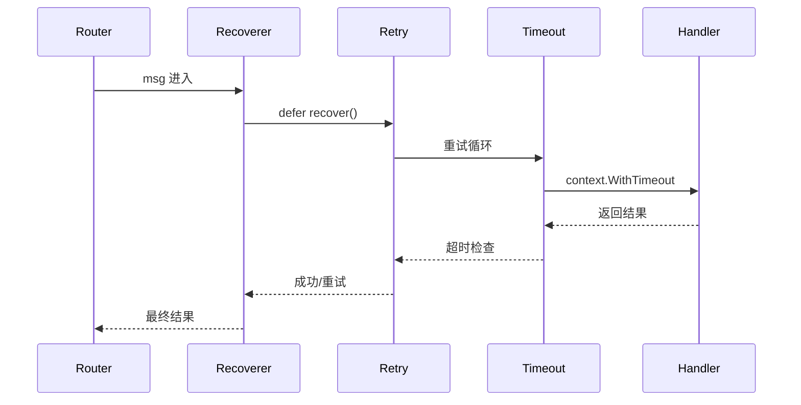

# 05 - Middleware 中间件

中间件是 Watermill 实现横切关注点的核心机制，采用经典的**责任链模式**。每个中间件在消息到达 Handler 之前和之后执行逻辑，形成一条处理链。

## 责任链架构



中间件按 `router.AddMiddleware()` 调用顺序执行，先注册的先进入、后退出（类似洋葱模型）。注册顺序直接影响行为——例如 Recoverer 应放在最外层以捕获所有 panic。

## 内置中间件

### Retry（重试）

```go
// basic/03-middleware/main.go:31-35
router.AddMiddleware(middleware.Retry{
    MaxRetries:      3,
    InitialInterval: 500 * time.Millisecond,
    Logger:          logger,
}.Middleware)
```

当 Handler 返回 error 时，Retry 中间件自动重新投递消息。支持指数退避（`Multiplier` 参数），避免瞬时故障导致重试风暴。注意：幂等 Handler 必不可少，否则重试可能造成重复副作用。

### Timeout（超时）

```go
router.AddMiddleware(middleware.Timeout(30 * time.Second))
```

给 Handler 注入带超时的 `context.Context`。超时后中间件返回 error，触发上层 Retry 重试。适合外部 API 调用场景——防止慢响应阻塞消费队列。

### Recoverer（恢复）

```go
router.AddMiddleware(middleware.Recoverer)
```

捕获 Handler 中的 panic，防止单个消息异常导致整个消费进程崩溃。Recoverer 将 panic 转换为 error 返回，配合 Retry 可实现自动恢复。

### Throttle（限流）

限制单位时间内处理的消息数量，防止下游系统被突发流量击垮。典型场景是调用第三方 API 时控制并发。

### PoisonQueue（毒药队列）

当一条消息重试超过最大次数仍未成功，PoisonQueue 中间件将其转移到专用"毒药队列"，避免阻塞正常消息消费。运维人员可后续手动处理异常消息。

## 自定义中间件

水车中间件函数签名为：

```go
type Middleware func(h message.HandlerFunc) message.HandlerFunc
```

本质上是一个高阶函数——接收 Handler，返回包装后的 Handler。自定义示例如下：

```go
func LoggingMiddleware(logger watermill.LoggerAdapter) message.Middleware {
    return func(h message.HandlerFunc) message.HandlerFunc {
        return func(msg *message.Message) ([]*message.Message, error) {
            logger.Info("处理开始", watermill.LogFields{"uuid": msg.UUID})
            msgs, err := h(msg)
            logger.Info("处理完成", watermill.LogFields{"uuid": msg.UUID, "err": err})
            return msgs, err
        }
    }
}
```

## 排序注意事项

在 `basic/03-middleware/main.go` 中可以看到典型的多中间件组合：

```
Recoverer → Retry → Timeout → Handler
```

关键原则：
1. **Recoverer 放最前**：在任何包装逻辑之前捕获 panic
2. **Retry 在 Timeout 之前**：超时后需要重试，而非重试中套超时
3. **Throttle 放最前**（与 Recoverer 同级）：限流应该限制整个链路
4. **业务中间件放最后**：如日志、指标采集等，贴近 Handler
