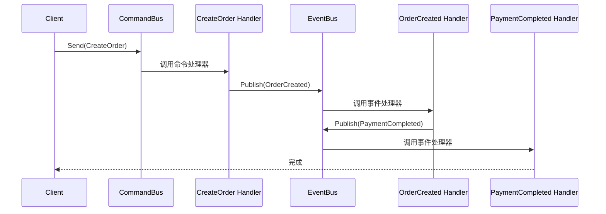

# 06 - CQRS 组件深入

Watermill 的 CQRS（Command Query Responsibility Segregation）组件在 Pub/Sub 之上提供了一层**类型安全**的命令/事件抽象，位于 `components/cqrs` 包。

## Command 与 Event 的区别

| 维度 | Command（命令） | Event（事件） |
|------|---------------|-------------|
| 语义 | 意图/请求："创建订单" | 事实/结果："订单已创建" |
| 命名 | 动词短语：CreateOrder | 过去式：OrderCreated |
| 目标 | 有明确的执行者 | 可以有任意多个订阅者 |
| 幂等 | 不需要（一条命令只处理一次） | 需要（事件可被多次消费） |

## Marshaler 接口

Marshaler 负责将 Go 结构体序列化为消息 Payload，以及反序列化回结构体：

```go
type CommandEventMarshaler interface {
    Marshal(v interface{}) ([]byte, error)
    Unmarshal(data []byte, v interface{}) error
    Name(v interface{}) string  // 返回类型名，用于生成 topic
}
```

Watermill 内置 `JSONMarshaler`（`encoding/json`），在 `basic/04-cqrs/main.go:45` 中使用：

```go
marshaler := cqrs.JSONMarshaler{}
```

电商项目中使用自定义 `ProtoMarshaler`（`ecommerce/pkg/events/events.go:25-37`），基于 Protobuf 实现更高的序列化效率和跨语言兼容性。

## Facade 配置

`cqrs.NewFacade` 接收 `FacadeConfig` 配置（`basic/04-cqrs/main.go:46-94`），核心参数：

- **GenerateCommandsTopic / GenerateEventsTopic**：自定义 topic 命名策略，决定命令/事件路由到哪个 Kafka topic。示例中将 `CreateOrder` 路由到 `commands.CreateOrder`。
- **CommandHandlers**：命令处理函数工厂，返回 `[]cqrs.CommandHandler`，每个绑定一个命令类型
- **EventHandlers**：事件处理函数工厂，每个绑定一个事件类型
- **CommandsPublisher / CommandsSubscriberConstructor**：指定命令通道的 Pub/Sub 实现
- **EventsPublisher / EventsSubscriberConstructor**：指定事件通道的 Pub/Sub 实现

## CommandHandler 与 EventHandler

命令处理器在 `basic/04-cqrs/main.go:55-63` 定义：

```go
cqrs.NewCommandHandler(
    "create_order",
    func(ctx context.Context, cmd *CreateOrder) error {
        fmt.Printf("创建订单: %s\n", cmd.OrderID)
        return eb.Publish(ctx, &OrderCreated{OrderID: cmd.OrderID})
    },
)
```

事件处理器在 `basic/04-cqrs/main.go:68-85` 定义，一个事件可以有多个处理器：

```go
cqrs.NewEventHandler(
    "order_created_handler",
    func(ctx context.Context, event *OrderCreated) error {
        // 自动从事件中解出类型信息，无需手动 Unmarshal
        return eb.Publish(ctx, &PaymentCompleted{...})
    },
)
```

## CQRS 工作流

以 `basic/04-cqrs` 的完整流程为例：



CQRS 组件的价值在于 **类型安全**：Handler 中操作的是具体 Go 类型（`*CreateOrder`、`*OrderCreated`），而非原始的 `*message.Message`，IDE 可以提供完整的代码提示和编译期检查。

## 与电商项目的关系

电商项目未直接使用 `components/cqrs`，而是基于更底层的 `message.Router` 实现事件路由。这是因为 Saga 模式需要精确控制事件发布时序和补偿逻辑，底层的 Router 提供了更大的灵活性。推荐学习路径：先用 CQRS 组件快速原型，再按需下沉到 Router 层。
