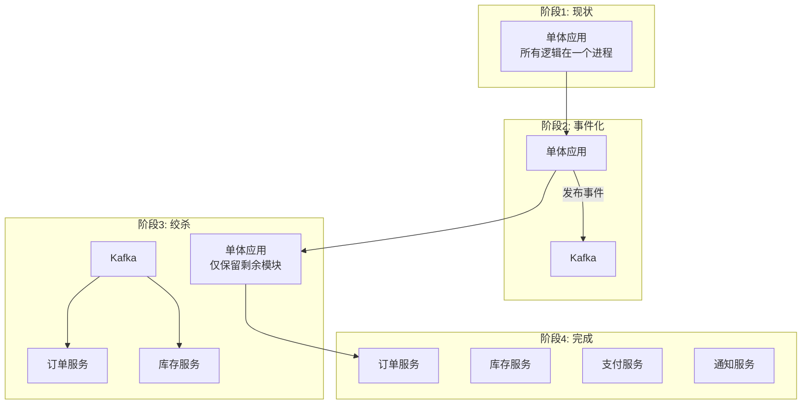

# 22 - 从单体迁移到事件驱动

将现有单体应用迁移到事件驱动架构是一项复杂的工程。本章提供增量迁移策略，避免"大爆炸"重写的风险。

## 增量迁移策略



## 阶段 1：识别事件边界

先不写代码。分析现有单体中哪些业务操作会产生跨模块影响：

| 业务操作 | 影响范围 | 候选事件 |
|---------|---------|---------|
| 用户注册 | 发送欢迎邮件、初始化积分 | UserRegistered |
| 下单 | 库存扣减、优惠券核销、通知 | OrderPlaced |
| 退款 | 库存恢复、财务记录、通知 | RefundInitiated |

选择低风险、非关键路径的用例作为试点（如通知发送），验证事件机制的稳定性后再推广到核心路径。

## 阶段 2：Strangler Fig 模式

**绞杀者模式**的核心思想：不修改现有单体代码，而是在其外围"包裹"事件层。

具体做法：

```go
// 单体中原有的下单函数
func PlaceOrder(order Order) error {
    tx.Begin()
    tx.Insert(order)
    tx.Insert(orderItems)
    tx.Commit()

    // 新增：发布事件（不影响原有事务）
    go eventPublisher.Publish("order.placed", order.ToEvent())
    return nil
}
```

使用 goroutine 异步发布事件，确保事件发布失败不影响原有业务流程。初期发布者用 GoChannel（进程内），验证无误后切换 Kafka。

## 阶段 3：双写过渡

当新服务（如独立的 inventory-service）接替单体中的库存模块时，需要双写过渡：

```
用户请求
├── 单体（旧库存模块）：扣减库存
└── inventory-service（新）：扣减库存
```

**双写策略**：
1. 初期：以旧结果为准，新服务的结果仅记录日志
2. 并行运行 N 天，对比两个系统的输出一致性
3. 确认一致后切换：以新服务为准，旧模块降级为旁路
4. 清理：移除旧模块代码

## Canary 发布事件消费者

新事件消费者上线时采用 Canary 发布策略：

```yaml
# 通过特性开关控制新消费者
features:
  new_inventory_service_enabled: true  # 灰度 10% 流量
```

```go
if featureFlag.IsEnabled("new_inventory_service") {
    router.AddNoPublisherHandler("inventory_v2", topic, sub, handlerV2)
} else {
    router.AddNoPublisherHandler("inventory_v1", topic, sub, handlerV1)
}
```

逐步放大流量：10% → 50% → 100%，每个阶段观察至少 1 天。

## 事件 Schema 版本管理

迁移过程中事件结构会不断演进，需要向后兼容：

- **新增字段**：Protobuf 的新字段使用新编号，旧消费者忽略未知字段
- **删除字段**：标记为 `reserved`，不回收字段编号
- **类型变更**：新增 `v2_discount_amount`，保留 `v1_amount` 直到所有消费者升级

```proto
message OrderPlaced {
    string order_id = 1;
    double total = 2;           // v1
    double total_cent = 3;      // v2: 改为分
    reserved 4, 5;              // 删除的字段
}
```

## 迁移检查清单

| # | 检查项 | 状态 |
|---|--------|------|
| 1 | 识别出所有可事件化的业务边界 | ☐ |
| 2 | 确定试点功能（非关键路径） | ☐ |
| 3 | 引入 Watermill，GoChannel 本地验证 | ☐ |
| 4 | 单体中异步发布事件（goroutine） | ☐ |
| 5 | 新增独立消费者服务，双写对比 | ☐ |
| 6 | 部署 Kafka/其他消息队列基础设施 | ☐ |
| 7 | 消费者服务从 GoChannel 切换到 Kafka | ☐ |
| 8 | Canary 发布，灰度验证 | ☐ |
| 9 | 全量切换，下线旧模块 | ☐ |
| 10 | 清理代码，更新文档和监控 | ☐ |

## 常见陷阱

- **过早抽象**：不需要一开始就建 10 个微服务，事件发布者 2-3 个足够
- **事件爆炸**：不要每个数据库 INSERT 都发事件，只发有业务含义的领域事件
- **忽略回滚**：迁移期间保留旧代码路径，一旦新系统出错可快速回退
- **监控盲区**：新事件消费者的监控和告警必须先于全量上线
