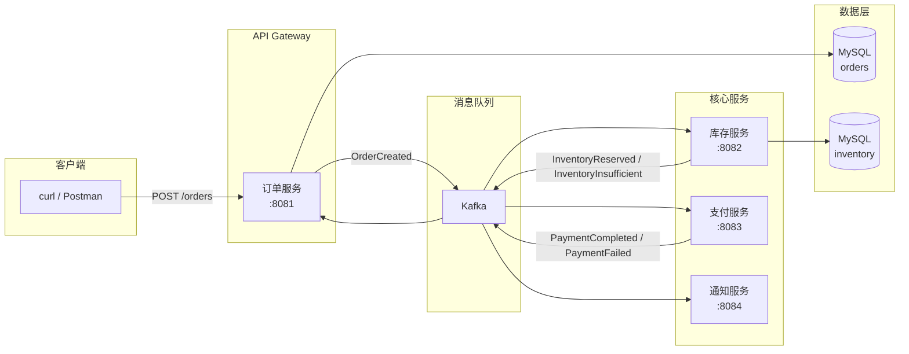

# 07 - 电商服务架构设计

本章介绍基于 Watermill + Kafka 的电商事件驱动系统的整体架构设计。

## 总体架构



## 服务拆分原则

系统拆分为 4 个独立微服务，遵循**领域驱动设计（DDD）**的限界上下文原则：

| 服务 | 职责 | 端口 | 数据存储 |
|------|------|------|----------|
| order-service | 订单创建、状态管理 | 8081 | MySQL (orders 表) |
| inventory-service | 库存扣减、释放回滚 | 8082 | MySQL (inventory 表) |
| payment-service | 支付处理（模拟 90% 成功率） | 8083 | 无持久化（模拟） |
| notification-service | 多渠道事件通知 | 8084 | 无持久化（日志输出） |

每个服务拥有独立数据库（Database per Service），避免共享数据库带来的耦合问题。

## 事件契约设计

事件是服务间通信的唯一契约。本系统使用 **Protobuf** 定义事件 schema：

```
api/proto/events/v1/events.proto
```

Protobuf 的优势：
- **强类型**：编译期保证消息结构一致，杜绝 JSON 字段拼写错误
- **高效序列化**：体积比 JSON 小 3-10 倍，适合高吞吐场景
- **前后兼容**：字段编号而非名称匹配，平滑演进

核心事件类型清单：

| 事件 | 发布者 | 订阅者 |
|------|--------|--------|
| OrderCreated | order-service | inventory-service, notification-service |
| InventoryReserved | inventory-service | payment-service |
| InventoryInsufficient | inventory-service | order-service |
| InventoryRelease | payment-service | inventory-service |
| PaymentCompleted | payment-service | order-service, notification-service |
| PaymentFailed | payment-service | order-service |
| OrderCancelled | order-service | notification-service |

所有 topic 常量和序列化工具在 `ecommerce/pkg/events/events.go` 中集中管理：

```go
const (
    TopicOrderCreated       = "order.events"
    TopicInventoryReserved  = "inventory.events"
    TopicPaymentCompleted   = "payment.events"
    // ...
)
```

## 技术栈总结

| 组件 | 版本 | 用途 |
|------|------|------|
| Watermill | v1.5 | 事件驱动框架 |
| watermill-kafka | v3 | Kafka 适配器 |
| Kafka | 通过 Docker Compose | 消息队列 |
| GORM | v2 | ORM |
| MySQL | 8.0 | 数据持久化 |
| Protobuf | proto3 | 事件序列化 |
| Viper | v1 | YAML 配置管理 |
| Zap | v1 | 结构化日志 |
