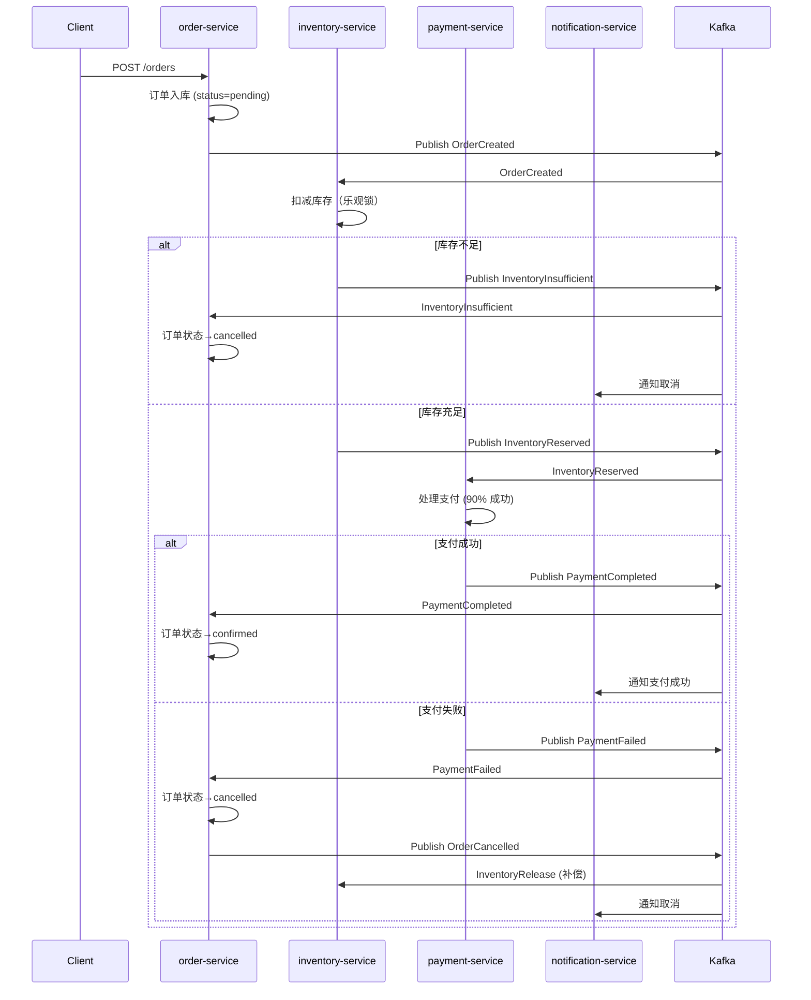
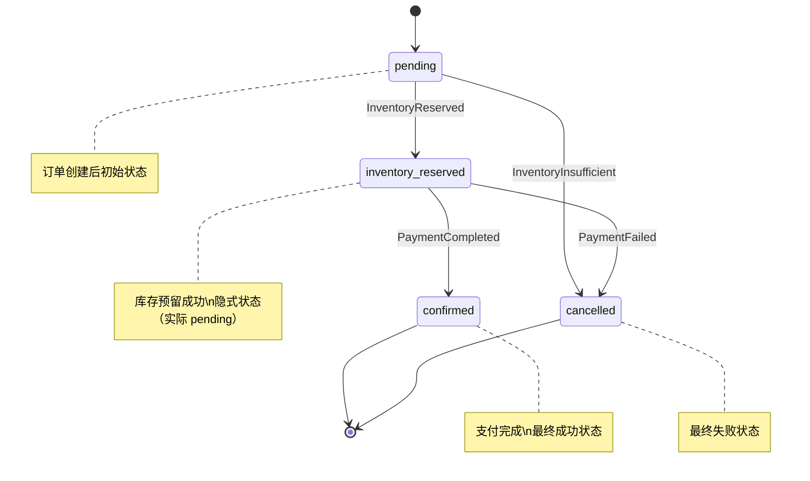

# 08 - 事件流与 Saga 模式

电商系统的核心挑战是**跨服务事务一致性**——订单创建涉及库存扣减和支付，多个操作要么全部成功，要么全部回滚。本系统采用 **Saga 模式**解决此问题。

## 完整事件流



## Saga 协调模式

Saga 有两种实现变体：

- **编舞（Choreography）**：每个服务监听事件并自主决定下一步行动，无中心协调器。简单、松耦合。**本项目采用此模式**。
- **编排（Orchestration）**：中心 Saga 协调器显式指挥每一步，失败时发起补偿。可控性强但引入单点。

编舞模式中，事件流本身就是协调逻辑。order-service 发布 `OrderCreated` → inventory-service 自行扣减 → payment-service 自行处理支付 → 结果事件传回 order-service 更新状态。每个服务只关心自己领域的事件，无需知道全局流程。

## 补偿事务

Saga 的核心是**补偿（Compensation）**——失败时执行反向操作恢复数据一致性。

**库存不足补偿**（`ecommerce/internal/inventory/biz/event_handler.go:34-40`）：

```go
for _, prev := range event.Items {
    if prev.ProductId == item.ProductId {
        break
    }
    h.uc.Restore(context.Background(), prev.ProductId, prev.Quantity)
}
```

**支付失败补偿**：order-service 将订单状态改为 cancelled 后，发布 `OrderCancelled` 事件。inventory-service 监听此事件，释放之前预留的库存：

```go
// internal/inventory/biz/event_handler.go:60-69
func (h *InventoryEventHandler) HandleInventoryRelease(msg *message.Message) error {
    // 将扣减的库存恢复
    h.uc.Restore(context.Background(), item.ProductId, item.Quantity)
}
```

## 状态机

订单状态流转采用明确的状态机模型：



状态变更通过 `orderRepo.UpdateStatus()` 方法执行（`ecommerce/internal/order/data/repo.go:28-29`），每次状态变更都会记录到数据库，支持审计和故障恢复。

## 错误处理策略

| 场景 | 处理方式 | 涉及服务 |
|------|---------|---------|
| 库存不足 | 回滚已扣减的库存 + 取消订单 | inventory, order |
| 支付失败 | 取消订单 + 释放库存 | payment, order, inventory |
| 支付超时 | 无显式处理（简化版）| 可配合 Timeout 中间件 |
| Kafka 不可用 | 服务启动失败（简化版）| 可结合 Circuit Breaker |

完整的错误处理还包括 Retry 中间件的自动重试（`ecommerce/cmd/order-service/main.go:71`）。

```go
router.AddMiddleware(middleware.Retry{
    MaxRetries: 3, InitialInterval: time.Second, Logger: watermillLogger,
}.Middleware)
```
