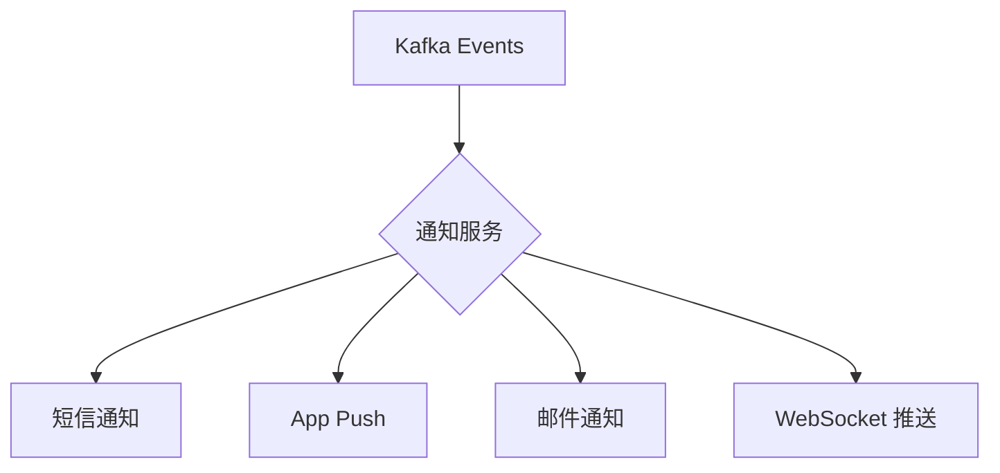

# 12 - 通知服务与事件聚合

通知服务是多事件聚合（Event Aggregation）的典型应用——它监听多个 topic，将分散的事件信息整合为统一的用户通知。

## 多事件订阅

通知服务同时订阅 3 个 topic（`ecommerce/cmd/notification-service/main.go:50-52`）：

```go
router.AddNoPublisherHandler("order_created_notify",
    events.TopicOrderCreated, sub, handler.HandleOrderCreated)
router.AddNoPublisherHandler("payment_completed_notify",
    events.TopicPaymentCompleted, sub, handler.HandleOrderConfirmed)
router.AddNoPublisherHandler("order_cancelled_notify",
    events.TopicOrderCancelled, sub, handler.HandleOrderCancelled)
```

这种模式的优点是：新增通知类型只需添加新的 Handler，不影响已有通知逻辑。

## 通知处理器

`ecommerce/internal/notification/biz/event_handler.go` 实现了三种通知：

```go
func (h *NotificationHandler) HandleOrderCreated(msg *message.Message) error {
    var event eventsv1.OrderCreated
    proto.Unmarshal(msg.Payload, &event)
    h.log.Info(fmt.Sprintf("通知: 用户 %s 的订单 %s 已创建", event.UserId, event.OrderId))
    return nil
}

func (h *NotificationHandler) HandleOrderConfirmed(msg *message.Message) error {
    var event eventsv1.PaymentCompleted
    proto.Unmarshal(msg.Payload, &event)
    h.log.Info(fmt.Sprintf("通知: 订单 %s 支付成功", event.OrderId))
    return nil
}

func (h *NotificationHandler) HandleOrderCancelled(msg *message.Message) error {
    var event eventsv1.OrderCancelled
    proto.Unmarshal(msg.Payload, &event)
    h.log.Info(fmt.Sprintf("通知: 订单 %s 已取消，原因: %s", event.OrderId, event.Reason))
    return nil
}
```

## 从日志到多通道扩展

当前实现仅通过 Zap logger 输出日志。实际系统中可以扩展为多通道通知：



扩展方式非常自然——每个 Handler 内部调用不同通知通道的实现，事件处理函数签名不变。推荐将通知通道抽象为接口：

```go
type Notifier interface {
    Send(ctx context.Context, userID string, title string, body string) error
}
```

## FanOut 模式应用

通知服务本身就是 FanOut 的实际应用——同一个事件（如 `PaymentCompleted`）被多个 Handler 订阅：

| 事件 | order-service | notification-service |
|------|:---:|:---:|
| OrderCreated | | ✓ |
| PaymentCompleted | ✓ (更新状态) | ✓ (发送通知) |
| OrderCancelled | | ✓ |

在 Watermill 中实现这种 FanOut 非常自然——多个 `AddNoPublisherHandler` 订阅同一 topic 即可，Router 内部自动管理多条消息副本的传递。

## 异步处理模型

通知服务与支付服务不同——它**只消费**事件，不发布新事件。这是"事件终点"（Event Sink）模式：

```
Kafka → Router → Handler → 通知给用户（日志/短信/Push）
```

Router 的并发控制（`HandlerMaxConcurrency`）在这里非常有用。如果短信接口 QPS 有限，可通过减小并发数防止服务被限流。当前默认并发 1，保证通知按事件时间顺序发送。

## 错误处理

通知失败通常不应阻塞业务流程。建议策略：
- **日志告警**：错误记录到 Zap logger，触发监控告警
- **不返回 error**：Handler 返回 nil，Router 正常 ACK，避免消息堆积
- **异步重试**：通过 sidecar 进程或独立重试队列处理失败通知

这种"尽力通知"（Best-Effort Notification）策略确保通知失败不影响订单、库存、支付等核心业务流程。
