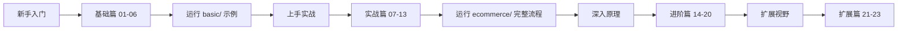

# Watermill 学习文档

基于 [Watermill](https://github.com/ThreeDotsLabs/watermill) 的 Go 事件驱动编程完整中文学习指南。

## 文档索引

### 基础篇 — 核心概念与 API

| # | 文档 | 内容 |
|---|------|------|
| 01 | [为什么学习 Watermill](./基础篇/01-为什么学习-Watermill.md) | 同步 vs 异步、事件驱动优势、技术选型对比 |
| 02 | [核心概念](./基础篇/02-核心概念.md) | Message/Pub/Sub/Router/Middleware/CQRS 全景图 |
| 03 | [Publisher 与 Subscriber 详解](./基础篇/03-Publisher与Subscriber详解.md) | GoChannel 实现、Ack/Nack、多后端切换 |
| 04 | [Router 路由机制](./基础篇/04-Router路由机制.md) | Handler 注册、消费者组、并发控制、去重 |
| 05 | [Middleware 中间件](./基础篇/05-Middleware中间件.md) | 责任链模式、Retry/Timeout/Recoverer/PoisonQueue |
| 06 | [CQRS 组件深入](./基础篇/06-CQRS组件深入.md) | Command/Event 分离、Marshaler、Facade 配置 |

### 实战篇 — Kafka 电商实战

| # | 文档 | 内容 |
|---|------|------|
| 07 | [电商服务架构设计](./实战篇/07-电商服务架构设计.md) | 微服务拆分、事件契约、技术栈总览 |
| 08 | [事件流与 Saga 模式](./实战篇/08-事件流与Saga模式.md) | Saga 编舞、补偿事务、状态机、错误处理 |
| 09 | [订单服务实现](./实战篇/09-订单服务实现.md) | Clean Architecture、HTTP API、事件发布消费 |
| 10 | [库存服务与补偿机制](./实战篇/10-库存服务与补偿机制.md) | 乐观锁扣减、补偿回滚、并发安全 |
| 11 | [支付服务与外部集成](./实战篇/11-支付服务与外部集成.md) | 模拟支付、异步处理、外部对接建议 |
| 12 | [通知服务与事件聚合](./实战篇/12-通知服务与事件聚合.md) | 多事件订阅、FanOut、多通道通知扩展 |
| 13 | [运行与部署指南](./实战篇/13-运行与部署指南.md) | Docker Compose、启动验证、问题排查 |

### 进阶篇 — 深度原理与工程实践

| # | 文档 | 内容 |
|---|------|------|
| 14 | [Kafka 集成详解](./进阶篇/14-Kafka集成详解.md) | 配置参数、分区策略、Offset 管理、Rebalance |
| 15 | [消息顺序与去重](./进阶篇/15-消息顺序与去重.md) | 分区顺序保证、幂等策略、去重实现 |
| 16 | [可靠性保障](./进阶篇/16-可靠性保障.md) | 投递语义、重试链路、故障恢复、Exactly-once |
| 17 | [可观测性与监控](./进阶篇/17-可观测性与监控.md) | Prometheus、OpenTelemetry、结构化日志 |
| 18 | [Outbox 模式与事务消息](./进阶篇/18-Outbox模式与事务消息.md) | 原子性难题、Forwarder、CDC 对比 |
| 19 | [FanIn 与 FanOut](./进阶篇/19-FanIn与FanOut.md) | 消息路由拓扑、广播与合并模式 |
| 20 | [性能优化与最佳实践](./进阶篇/20-性能优化与最佳实践.md) | Kafka 调优、反模式、压测建议 |

### 扩展篇 — 视野与选型

| # | 文档 | 内容 |
|---|------|------|
| 21 | [多 Pub/Sub 后端对比](./扩展篇/21-多PubSub后端对比.md) | GoChannel/Kafka/NATS/Redis/RabbitMQ/SQL 对比 |
| 22 | [从单体迁移到事件驱动](./扩展篇/22-从单体迁移到事件驱动.md) | 绞杀者模式、双写过渡、Canary 发布 |
| 23 | [常见问题与排查](./扩展篇/23-常见问题与排查.md) | FAQ、调试技巧、错误场景分析 |

## 推荐学习路径



### 路径 1：新手入门（1-2 天）

1. 阅读 **基础篇 01-06**，理解核心概念
2. 运行 `basic/` 目录下 5 个示例，动手修改代码
3. 完成对 Pub/Sub、Router、Middleware、CQRS 的直观感受

### 路径 2：上手实战（2-3 天）

1. 阅读 **实战篇 07-13**，理解事件驱动电商架构
2. 启动 Docker Compose 基础设施
3. 依次启动 4 个微服务，通过 curl 触发 Saga 流程
4. 追踪日志，理解完整事件流

### 路径 3：深入原理（3-5 天）

1. 阅读 **进阶篇 14-20**，掌握生产级实践
2. 理解 Kafka 集成、可靠性、可观测性、Outbox 模式
3. 思考：如何将项目改造为生产级别？

### 路径 4：扩展视野（1-2 天）

1. 阅读 **扩展篇 21-23**，拓展技术视野
2. 比较不同 Pub/Sub 后端的适用场景
3. 思考：当前团队系统如何迁移到事件驱动？

## 项目代码结构

```
watermill/
├── basic/                    # 基础示例（GoChannel 零依赖）
│   ├── 01-pubsub/main.go     # Publisher + Subscriber
│   ├── 02-router/main.go     # Router 消息路由
│   ├── 03-middleware/main.go # 中间件：重试/超时/恢复
│   ├── 04-cqrs/main.go       # CQRS 命令与事件分离
│   └── 05-metrics/main.go    # Prometheus 指标采集
├── ecommerce/                # Kafka 事件驱动电商
│   ├── api/proto/            # Protobuf 事件定义
│   ├── cmd/                  # 4 个微服务入口
│   │   ├── order-service/
│   │   ├── inventory-service/
│   │   ├── payment-service/
│   │   └── notification-service/
│   ├── internal/             # Clean Architecture 分层
│   │   ├── order/            # 订单服务：service/biz/data
│   │   ├── inventory/        # 库存服务
│   │   ├── payment/          # 支付服务
│   │   └── notification/     # 通知服务
│   ├── pkg/                  # 共享基础设施
│   │   ├── kafka/            # Kafka 连接管理
│   │   ├── config/           # Viper YAML 配置
│   │   ├── database/         # GORM + MySQL
│   │   └── events/           # Protobuf 序列化 + Topic 常量
│   ├── deploy/               # Docker Compose
│   └── configs/              # 各服务配置文件
└── docs/                     # 本文档目录
```

## 外部资源

| 资源 | 链接 |
|------|------|
| Watermill 官方仓库 | https://github.com/ThreeDotsLabs/watermill |
| Watermill 官方文档 | https://watermill.io |
| Kafka 适配器 | https://github.com/ThreeDotsLabs/watermill-kafka |
| Sarama (Go Kafka 客户端) | https://github.com/IBM/sarama |
| GORM 文档 | https://gorm.io |
| Protobuf 指南 | https://protobuf.dev |
| Zap 日志库 | https://github.com/uber-go/zap |

---

**快速开始**：参考 [运行与部署指南](./实战篇/13-运行与部署指南.md) 5 分钟跑通完整电商系统。
